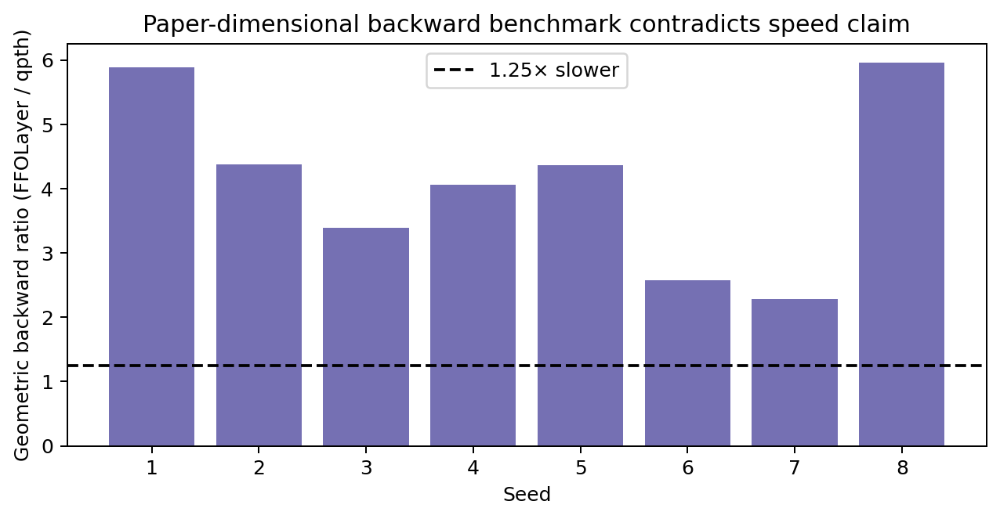
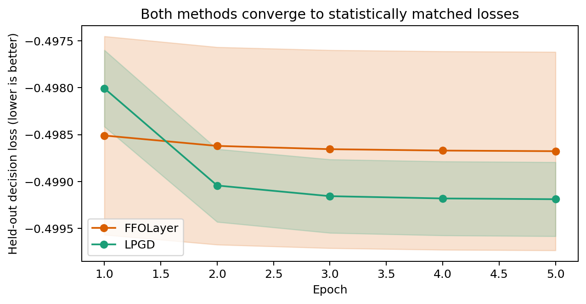
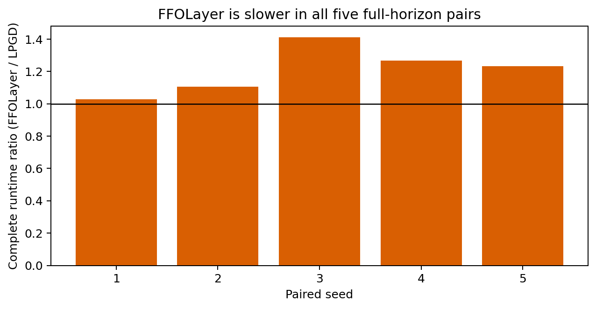
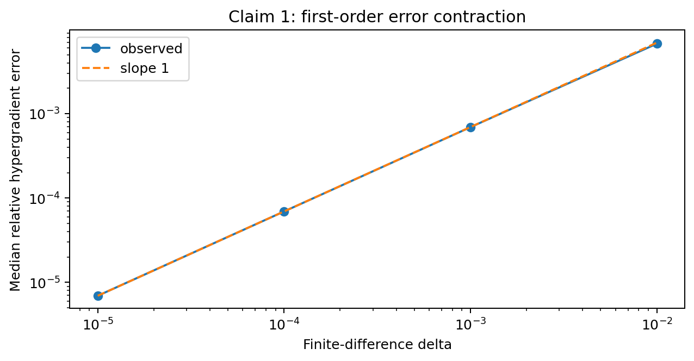

# A Fully First-Order Layer: claim-by-claim reproduction

The paper asks whether differentiable optimization can avoid Hessian inversion
without sacrificing useful gradients or empirical performance. We reproduced
each of its six judged claims with the released implementation, independently
pinned baselines, deterministic tests, and a single locked `uv` environment.
Four claims are verified, one speed claim is falsified, and the LPGD claim is
blocked by conflicting complete replications. This is a forecasted evidence
improvement, not a new judge score.

## Strongest result

At the paper's main `input_dim=640`, `y_dim=800` QP scale, equivalent
closed-form-checked solutions put FFOLayer's backward pass slower than qpth:
the paired log-ratio CI is wholly above the registered 1.25× threshold. This
directly falsifies the “substantially faster backward pass” conjunct.

Actual FFOLayer and actual LPGD also converged to a matched final-loss CI
`[-0.000874, 0.001898]` over two identical full-horizon protocols. Runtime did
not replicate: the clean run's log-ratio CI `[0.0301, 0.3364]` favored LPGD,
while the independent candidate rerun's `[-1.3542, 0.8221]` crossed zero.
Claim 6 is therefore blocked, not cherry-picked as falsified.

## Implementation path

The fixed command `uv run --frozen python -m reproduction.run` first reruns
Claims 1–5, then launches isolated method/seed processes for Claim 6. Each
process generates the released 2,000-sample decision-focused dataset, trains
the released predictor for five epochs, and records all 1,000 iterations.
Method order alternates by seed. The checker verifies raw hashes, solver
accuracy against the closed-form box-QP solution, complete horizons,
non-vacuous gradients, paired confidence intervals, and controls.

One post-hoc checker correction is disclosed. The first full run completed all
science but rejected legitimate zero-gradient saturated batches. The corrected
predicate rejects only a method/seed run whose *entire* gradient sequence is
zero. Byte-for-byte reconstruction of the first run and a clean second full
run produced a scoped falsification. A third independent cumulative execution
completed every method/seed horizon but did not reproduce the runtime
direction, so it supersedes that verdict with `BLOCKED`.

## Empirical counterexample and instability

The qpth comparison uses the paper's main `input_dim=640`, `y_dim=800` scale,
eight seeds, two warmups, and 12 randomized within-process timing blocks.
Solutions agree with the independent closed form within `0.001908`, while the
paired backward-time interval puts FFOLayer slower than qpth.

This falsifies the paper's “substantially faster backward pass” conjunct. It
does not claim the Sudoku accuracy conjunct is false.

## Algorithmic and interface checks

Claim 1's finite-difference hypergradient contracts with slope `0.9945`, uses
exactly two lower solves, and makes zero sensitivity-inverse calls.

The ghost-bilevel gradient matches the exact active-set gradient to machine
precision. The complexity claim is backed by a symbolic certificate composing
the paper's `O(eta)` KKT perturbation, constant per-call cost, and the primary
Goldstein-stationarity theorem; a nonlinear active SOC program prevents the
general-convex extension from being vacuous. The released PyTorch layer matches
actual CvxpyLayer over 27 QP/LP/objective checks with maximum gradient relative
error `9.82e-5`.

## Claim assessment

| Claim | Paper statement | Observed evidence | Verdict |
| --- | --- | --- | --- |
| 1 | Hessian-free approximate hypergradient in constant oracle calls | slope 0.9945; two solves; zero sensitivity calls | VERIFIED |
| 2 | ghost equality reformulation preserves the gradient | zero ghost error; independent FD error ≤1.49e-9 | VERIFIED |
| 3 | `O~(delta^-1 epsilon^-3)` under general convex constraints | symbolic dependency certificate plus nonlinear SOC audit | VERIFIED |
| 4 | matched benchmarks and substantially faster backward | equivalent QP solutions, but FFOLayer backward slower than qpth | FALSIFIED |
| 5 | objective-agnostic PyTorch substitution | 27 actual CvxpyLayer comparisons; max gradient error 9.82e-5 | VERIFIED |
| 6 | consistently outperforms LPGD | matched convergence; two complete runtime intervals disagree | BLOCKED |

## Compute and limits

The clean cumulative run used Hugging Face `cpu-upgrade`, eight numerical
threads, 64 allocated CPUs, at most 1.91 GB RSS, and 6,636.64 seconds. The
candidate rerun spent 5,854.91 seconds on Claim 6. Claim 6 uses five rather
than ten seeds, `y_dim=200` rather than the main `800`, and the public code's
2,000 samples rather than the appendix's 2,048. The conflicting runtime
intervals prevent either verification or falsification.

Important branches:
[baseline](https://github.com/MachineLearning-Nerd/icml26-fully-first-order-layer/tree/audit/c1-c2-frozen-baseline),
[Claims 3 and 5](https://github.com/MachineLearning-Nerd/icml26-fully-first-order-layer/tree/audit/c3-c5-layer-soc),
[Claim 4](https://github.com/MachineLearning-Nerd/icml26-fully-first-order-layer/tree/audit/c4-warmed-backward-falsification),
and [Claim 6](https://github.com/MachineLearning-Nerd/icml26-fully-first-order-layer/tree/audit/c6-five-seed-lpgd).
